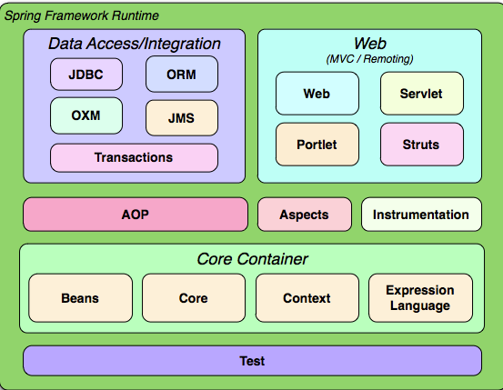

# Spring Framework

## Coupling

- Loose Coupling
  - easy to test and debug
  - easy to replace
- Tight Coupling
  - difficult to replace
  - tight relation between components

## Spring container

- BeanFActory
- ApplicationContext

## Spring

- 
  Running Application from Command Line

```
java -jar springdi-0.0.1-SNAPSHOT.jar
```
